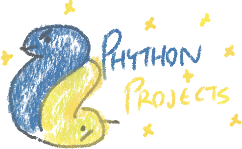

  

---

A collection of some of the **Python** projects I created while learning the language.

## Projects
### Flask
- [Higher-lower guessing game](higher-lower/README.md): Very simple Flask app for a number guessing game.
### Selenium
- [PythonAnywhere extender](selenium/python-anywhere-extender/README.md): Selenium script to automate extending the expiry of a PythonAnywhere task.
- [Rental search data scraper](selenium/rental-search/README.md): Selenium script to search for and scrape the rental listings for a particular address.
- [Internet speed complainer](selenium/speed-test/README.md): Selenium script to test internet speed and log in to twitter to rant about it.

## Acknowledgements

Learning from [100 Days of Code: The Complete Python Pro Bootcamp by Angela Yu](https://www.udemy.com/course/100-days-of-code/), and so many of the projects will be inspired or directed by that course.
