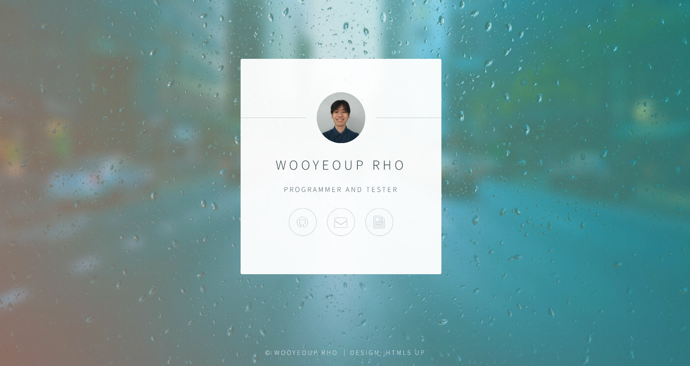

# Name Card Website

A simple website built with **Flask**. HTML and CSS for the website was provided through a template by [HTML5 UP](https://html5up.net/) - the 'Identity' template.

## Screenshot

  

## Technologies used
1. Python
2. Flask
3. HTML/CSS